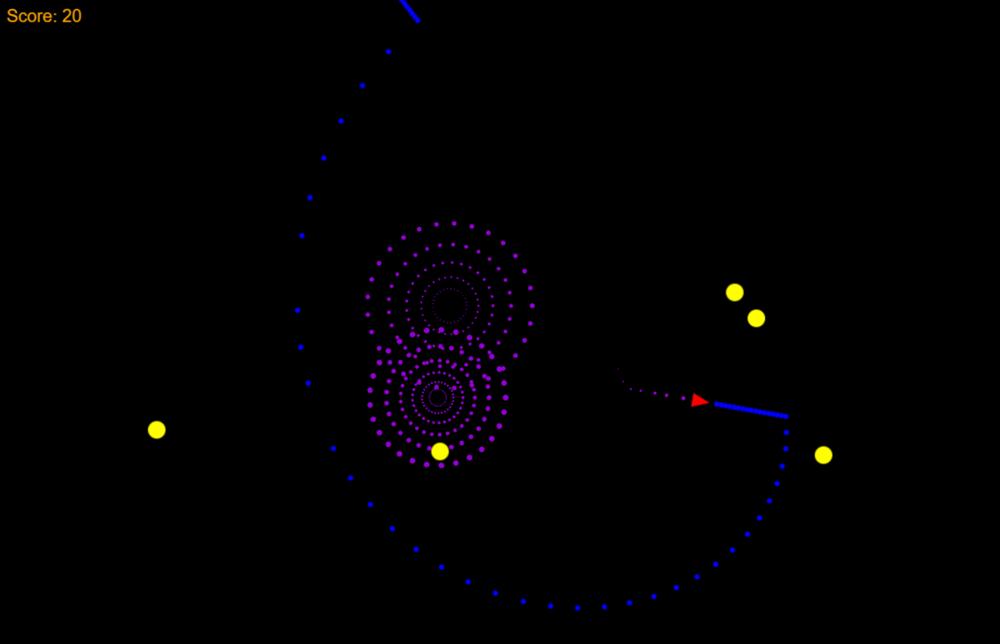

# Rocket on WASM Rewritten

A rewritten version of the [Rocket game](https://github.com/aochagavia/rocket_wasm), utilizing `wasm_bindgen` and built with `wasm-pack`. The module structure has been reorganized based on my insights.

## Screenshot



## How to Play

In the game, you control the red rocket and must save the world from the yellow invaders. Use the following keyboard controls to play:

| Keyboard | Action       |
| -------- | ------------ |
| ↑        | Boost        |
| ←        | Rotate left  |
| →        | Rotate right |
| Space    | Shoot        |

## Compiling and Running

You will need the standard Rust toolchain and `wasm-pack`. Please refer to this [setup guide](https://rustwasm.github.io/docs/book/game-of-life/setup.html).

After setting things up, compile the code using the following command:

```bash
wasm-pack build --target web
```

Once the build is complete, you can find the artifacts in the `pkg` directory.

-   The `.wasm` file is the WebAssembly binary generated by the Rust compiler.
-   The `.js` file is generated by `wasm-bindgen` and contains JavaScript glue code for importing DOM and JavaScript functions into Rust, and exposing a nice API to the WebAssembly functions for JavaScript.

To start a server, run:

```bash
python -m http.server
```

By default, it will host the site on `localhost` at port 8000.

Open [http://localhost:8000/](http://localhost:8000/) in your browser to check if it works.

## Reference

-   [Rocket on WASM](https://github.com/aochagavia/rocket_wasm)

-   [Rust WebAssembly A\* Pathfinding Demo](https://github.com/jacobdeichert/wasm-astar)

-   [Rust and WebAssembly, Hello World.](https://rustwasm.github.io/docs/book/game-of-life/hello-world.html)

-   [使用 Rust 和 WebAssembly 整花活儿(三)——Rust 与 JS 交互](https://github.com/hunter-ji/Blog/issues/74)
